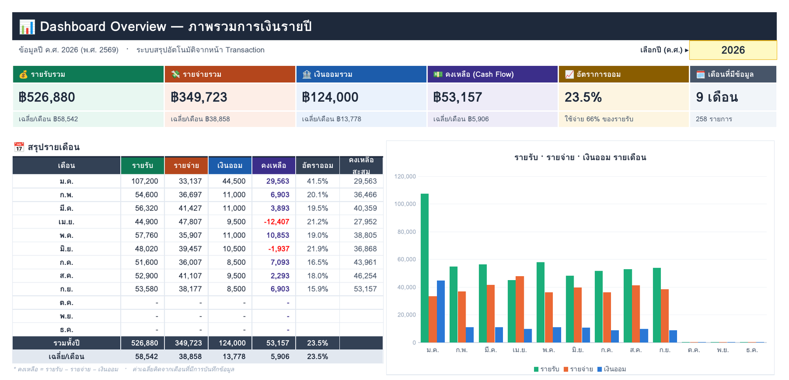
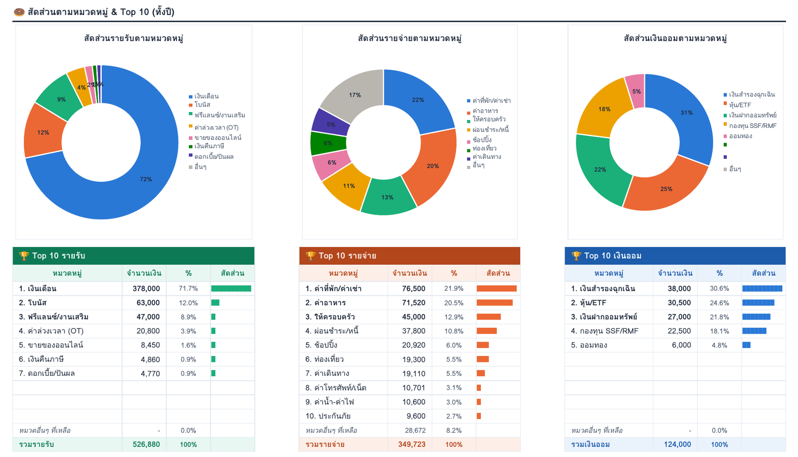
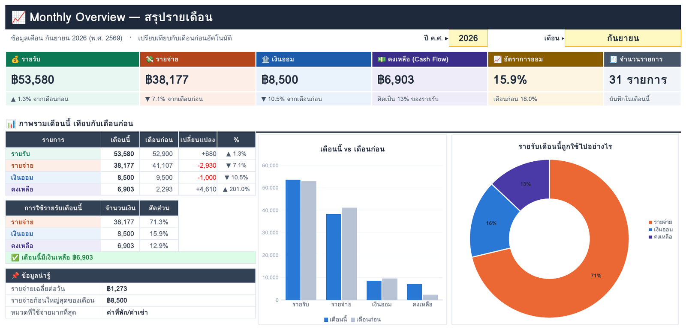
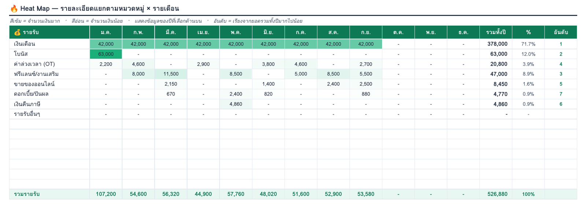
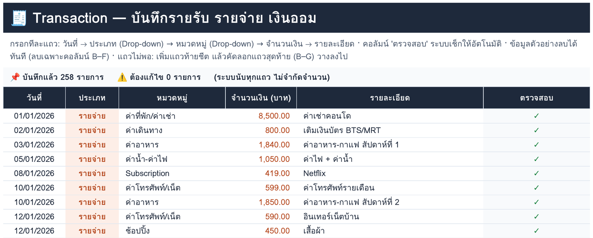
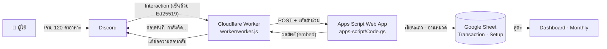

# 💰 บัญชีรายรับ-รายจ่าย × Discord

ระบบบัญชีรายรับ รายจ่าย เงินออม บน **Google Sheets** มี Dashboard ที่สรุปให้อัตโนมัติ และจดรายการจาก **Discord** ได้ด้วยคำสั่ง `/จ่าย` `/รับ` `/ออม` โดยไม่ต้องเปิดชีต

> **EN —** A Thai personal-finance tracker on Google Sheets (yearly/monthly dashboards, heat map, Top-10s) with a Discord bot for logging entries via slash commands.
> Discord → Cloudflare Worker (Ed25519-verified interactions) → Google Apps Script Web App → Sheet.
> Includes a Thai natural-language entry parser, built-in setup diagnostics, and an end-to-end test suite that signs real Ed25519 requests.



---

## ✨ ความสามารถ

### Google Sheet (4 หน้า)

| หน้า | ทำอะไรได้ |
|---|---|
| 📊 **Dashboard Overview** | เลือกปีได้ · การ์ดสรุปทั้งปีพร้อมค่าเฉลี่ยต่อเดือน · ตารางสรุป 12 เดือน (คงเหลือ, อัตราการออม, คงเหลือสะสม) · กราฟแท่ง · กราฟโดนัทแยกหมวด · Top 10 · Heat Map หมวด × เดือน |
| 📈 **Monthly Overview** | เลือกปีและเดือน · การ์ดเทียบกับเดือนก่อน (▲▼ %) · กราฟเทียบเดือนก่อน · โดนัท "รายรับถูกใช้ไปอย่างไร" · กราฟวงกลมแยกหมวด · Top 10 ของเดือน |
| 🧾 **Transaction** | บันทึกรายการพร้อม Drop-down ประเภทและหมวด · คอลัมน์ตรวจสอบความถูกต้องอัตโนมัติ · สูตรนับทุกแถว ไม่จำกัดจำนวน |
| ⚙️ **Setup** | หมวดหมู่ที่แก้ได้ (รายรับ 15 · รายจ่าย 25 · เงินออม 15) · ใช้เป็นที่มาของ Drop-down ทั้งในชีตและใน Discord |

| | |
|---|---|
|  |  |
|  |  |

### บอท Discord

- **`/จ่าย` `/รับ` `/ออม`** ใส่จำนวนเงิน → เลือกหมวดจาก Drop-down (ดึงจากหน้า Setup) → ใส่รายละเอียดและวันที่ได้ถ้าต้องการ
- **`/จด จ่าย 120 อาหาร ข้าวมันไก่`** พิมพ์ภาษาไทยรวดเดียว ระบบแยกประเภท จำนวน หมวด และวันที่ให้เอง รองรับ `1.5k` `1,250.50` เลขไทย `๑๒๐` วันที่แบบ `25/9` `25/9/2569` `เมื่อวาน` และคำย่อ เช่น ข้าว → ค่าอาหาร, BTS → ค่าเดินทาง
- **`/สรุป`** ยอดของเดือน (เลือกเดือนและปีได้) · **`/ยกเลิก`** ลบรายการล่าสุดที่จดผ่าน Discord
- ตอบกลับทันทีพร้อมยอดรวมของเดือน · ถ้าใช้นอกช่องบัญชี ตัวเลขจะเห็นเฉพาะคนสั่ง · ค่าเริ่มต้นให้เฉพาะแอดมินเซิร์ฟเวอร์ใช้คำสั่งได้
- เมนู **🩺 ตรวจสอบสถานะ** ในชีต ตรวจทุกจุดของการเชื่อมต่อ และบอกวิธีแก้ในข้อที่ไม่ผ่าน

---

## 🏗️ สถาปัตยกรรม



รายละเอียดการออกแบบ ความปลอดภัย และข้อจำกัดอยู่ใน [docs/architecture.md](docs/architecture.md)

## 📁 โครงสร้าง

```
.
├── apps-script/
│   ├── Code.gs              # Web App รับคำสั่ง · ตัวแยกข้อความภาษาไทย · เขียนชีต · เมนูตั้งค่า/ตรวจสถานะ
│   └── appsscript.json
├── worker/
│   ├── worker.js            # Interactions endpoint: ตรวจลายเซ็น · ส่งต่อ · ลงทะเบียนคำสั่ง · /status
│   └── wrangler.toml        # (ไม่บังคับ) ดีพลอยด้วย Wrangler CLI
├── sheets/
│   ├── income-expense-tracker.xlsx   # เทมเพลตพร้อมข้อมูลตัวอย่าง (สุ่ม ไม่ใช่ข้อมูลจริง)
│   └── build_template.py             # สคริปต์สร้างเทมเพลตด้วย openpyxl
├── docs/                    # setup · usage · architecture · ภาพตัวอย่าง
└── tests/                   # parser + end-to-end (Node 20+, ไม่ต้องติดตั้งแพ็กเกจ)
```

## 🚀 เริ่มใช้งาน

1. **ชีต:** อัปโหลด [`sheets/income-expense-tracker.xlsx`](sheets/income-expense-tracker.xlsx) ขึ้น Google Drive → เปิดด้วย Google Sheets → **ไฟล์ → บันทึกเป็น Google ชีต**
2. **บอท:** ติดตั้งตาม [docs/setup.md](docs/setup.md) (ใช้เวลาประมาณ 15 นาที ทุกส่วนใช้แพ็กเกจฟรี)
3. **วิธีใช้:** ดู [docs/usage.md](docs/usage.md)

## 🧪 การทดสอบ

```bash
npm test          # Node.js 20 ขึ้นไป ไม่ต้อง npm install
```

- **`tests/parser.test.mjs`** ทดสอบตัวแยกข้อความภาษาไทย: จำนวนเงินหลายรูปแบบ, เลขไทย, วันที่ พ.ศ./ค.ศ./ข้ามปี, คำย่อหมวด, ข้อความที่ไม่ใช่รายการ
- **`tests/e2e.test.mjs`** สร้างคีย์ Ed25519 จริงแล้วเซ็นคำขอแบบเดียวกับที่ Discord ส่ง → ผ่าน `worker.js` → รันโค้ด Apps Script จริงใน `node:vm` กับชีตจำลอง ครอบคลุม:
  - คำขอ PING, ลายเซ็นปลอม และ body ที่ถูกแก้
  - การลงทะเบียนคำสั่ง (ตรวจชื่อตามกฎของ Discord)
  - ทุกคำสั่ง รวมการใช้นอกช่องบัญชี
  - กรณีผิดพลาด: วันที่ผิด, หมวดถูกเปลี่ยนชื่อ, รหัสลับผิด, Deploy ผิดสิทธิ์
  - รายงานตรวจสถานะในชีต

## 💡 Design decisions และสิ่งที่ได้เรียนรู้

- **v1 ใช้ไม่ได้:** Apps Script ดึงข้อความจาก Discord ทุก 1 นาทีผ่าน Bot API แต่ Discord ตอบ **403 · code 40333 "internal network error"** ตลอด เพราะ `UrlFetchApp` บังคับใช้ User-Agent `Mozilla/5.0 (compatible; Google-Apps-Script)` ซึ่งเปลี่ยนไม่ได้ และ IP ของ Google ก็โดน rate limit (429) บ่อย
- **v2 กลับทิศการเชื่อมต่อ:** ให้ Discord เป็นฝ่ายส่ง Interaction มาที่ Cloudflare Worker แทน Worker ตรวจลายเซ็น Ed25519 ตอบแบบ deferred ภายในหลักมิลลิวินาที แล้วส่งงานต่อให้ Apps Script ระบบจึงไม่ต้องเรียก API ฝั่งข้อความที่ถูกบล็อกเลย และไม่ต้องรอรอบ 1 นาที
- **การวินิจฉัยเป็นส่วนหนึ่งของโปรดักต์:** เมนู 🩺 ตรวจสถานะทีละชั้น (ชีต → Worker → ตัวแปร → Discord app → endpoint → คำสั่ง) ทำให้หาจุดพังได้ในรอบเดียว แทนที่จะต้องเดา

## 🛠️ Tech stack

Google Sheets (SUMIFS · INDEX/MATCH · COUNTIFS · Conditional formatting) · Python + openpyxl · Google Apps Script (V8, Web App) · Cloudflare Workers (Web Crypto Ed25519) · Discord Interactions & Application Commands · Node.js (tests)

## 📄 License

[MIT](LICENSE)
