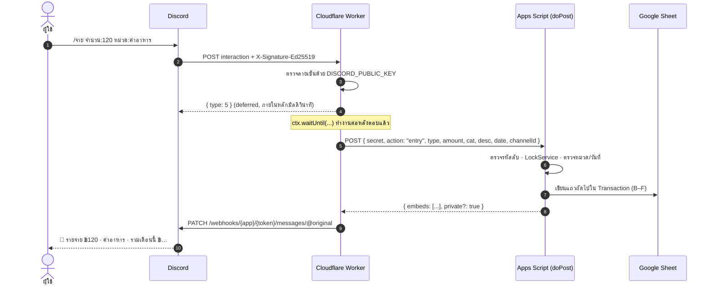

# 🏗️ Architecture

## ส่วนประกอบ

| ส่วน | ไฟล์ | หน้าที่ |
|---|---|---|
| Google Sheet | `sheets/income-expense-tracker.xlsx` | เก็บข้อมูล (Transaction) และหมวด (Setup) · Dashboard คำนวณด้วยสูตรล้วน ไม่มีสคริปต์ |
| Apps Script Web App | `apps-script/Code.gs` | รับคำสั่งจาก Worker · ตัวแยกข้อความภาษาไทย · เขียน/อ่านชีต · เมนูตั้งค่าและตรวจสถานะ |
| Cloudflare Worker | `worker/worker.js` | Interactions endpoint ของ Discord · ตรวจลายเซ็น · ตอบแบบ deferred · ลงทะเบียนคำสั่ง · `/status` |
| Template builder | `sheets/build_template.py` | สร้างไฟล์ชีตทั้ง 4 หน้า (สูตร · Conditional formatting · กราฟ · Data validation) ด้วย openpyxl |

## ลำดับการทำงานของ `/จ่าย`



## สัญญาข้อมูล Worker → Apps Script

ทุกคำขอเป็น `POST` JSON ที่มี `secret` (ต้องตรงกับ `LINK_SECRET` ใน Script Properties)

| `action` | ฟิลด์ | ผลลัพธ์ |
|---|---|---|
| `ping` | – | `{ ok, sheet, guildId, channelId }` |
| `config` | – | `{ ok, categories: { รายรับ: [...], รายจ่าย: [...], เงินออม: [...] }, guildId, channelId }` |
| `entry` | `type, amount, cat, desc?, date?` | `{ embeds }` |
| `text` | `text` (ข้อความแบบ `/จด`) | `{ embeds }` |
| `summary` | `month?, year?` | `{ embeds }` |
| `undo` | – | `{ embeds }` |

ทุก action ที่มี `embeds` จะได้ `private: true` เพิ่มมาด้วยถ้า `channelId` ไม่ตรงกับช่องที่ตั้งไว้ ถ้าเกิดข้อผิดพลาดจะคืน `{ error }`

## ความปลอดภัย

- **ลายเซ็น Ed25519:** Worker ตรวจทุกคำขอด้วย Web Crypto ถ้าลายเซ็นผิด ไม่มี หรือ body ถูกแก้ จะตอบ `401` (มีชุดทดสอบครอบคลุม)
- **รหัสลับร่วม:** Apps Script รับเฉพาะคำขอที่มี `secret` ตรงกัน และ `/register` `/status` ของ Worker ต้องมี `?key=` ที่ตรงกันเช่นกัน
- **เก็บความลับแยกที่:** Bot Token อยู่ใน Cloudflare Secrets เท่านั้น ไม่เก็บในชีตหรือ Apps Script
- **สิทธิ์ใช้คำสั่ง:** ค่าเริ่มต้น `default_member_permissions = Manage Server` คนทั่วไปในเซิร์ฟเวอร์จะไม่เห็นคำสั่ง
- **ตอบแบบส่วนตัว:** ใช้คำสั่งนอกช่องบัญชี → ข้อความสาธารณะไม่มีตัวเลข รายละเอียดส่งเป็น ephemeral (`flags: 64`)
- **กันสูตรแทรก:** รายละเอียดที่ขึ้นต้นด้วย `= + - @` จะถูกเขียนเป็นข้อความ ไม่ใช่สูตร
- **กันเขียนชนกัน:** `LockService` ล็อกระหว่างเขียน และ `/ยกเลิก` ลบเฉพาะแถวที่ยังตรงกับที่บันทึกไว้ (ถ้าแก้ในชีตแล้วจะไม่ลบ)

## ข้อจำกัด

| เรื่อง | ค่า | วิธีรับมือ |
|---|---|---|
| Discord ต้องได้คำตอบภายใน 3 วินาที | Apps Script อาจใช้ 1–5 วินาที | ตอบ deferred ก่อน แล้วค่อยแก้ข้อความ |
| ตัวเลือกใน Drop-down | สูงสุด 25 ตัวต่อช่อง | หน้า Setup จำกัดรายจ่าย 25 · รายรับ/เงินออม 15 หมวด |
| หมวดใน Discord เป็นค่าคงที่ | อัปเดตตอนลงทะเบียนคำสั่ง | เมนู 🔄 · ถ้าหมวดหายไป ระบบจับคู่ใหม่หรือลง "…อื่นๆ" พร้อมเตือน |
| `/ยกเลิก` | ย้อนได้ 20 รายการล่าสุด | ตั้ง `UNDO_LIMIT` ได้ |
| โควตาฟรี | Workers 100,000 คำขอ/วัน · Apps Script มีโควตารายวัน | เกินพอสำหรับใช้ส่วนตัว |

## เส้นทางที่ไม่เวิร์กและเหตุผลที่เปลี่ยน

**v1: Apps Script อ่านข้อความเองทุก 1 นาที (เลิกใช้แล้ว)**

```
Apps Script (time trigger) ──GET /channels/{id}/messages──▶ Discord Bot API
                           ──POST webhook──▶ ตอบกลับในช่อง
```

- Discord ตอบ `403` พร้อม `{"message": "internal network error", "code": 40333}` ทุกครั้ง แม้บอทจะมีสิทธิ์ครบ
- **สาเหตุ:** Discord (ผ่าน Cloudflare) บล็อกคำขอ Bot API ที่ใช้ User-Agent แบบเบราว์เซอร์ แต่ `UrlFetchApp` บังคับส่ง `Mozilla/5.0 (compatible; Google-Apps-Script)` และเปลี่ยนไม่ได้ นอกจากนี้ IP ของ Google ที่ใช้ร่วมกันยังโดน `429` เป็นพัก ๆ
- **บทเรียน:** อย่าเรียก API ฝั่งที่ถูกตรวจเข้ม จาก runtime ที่คุมเครือข่ายไม่ได้ ควรตรวจข้อจำกัดของแพลตฟอร์มก่อนออกแบบ

**v2: กลับทิศให้ Discord เป็นฝ่ายเรียกเรา (เวอร์ชันปัจจุบัน)**

- Interactions endpoint บน Cloudflare Worker รับคำสั่งจาก Discord โดยตรง และตอบกลับผ่าน interaction webhook ระบบจึงไม่ต้องเรียก API ฝั่งข้อความที่ถูกบล็อกเลย
- ได้ประโยชน์เพิ่ม:
  - ตอบทันทีแทนการรอรอบ 1 นาที
  - ไม่ต้องเปิด Message Content Intent
  - ได้ Drop-down หมวด ซึ่งลดการพิมพ์ผิด

## ต่อยอด

- **ช่องทาง LINE Official Account:** reply message ไม่นับโควตาข้อความ จึงเหมาะกับตลาดไทย
- **อ่านสลิปโอนเงินจากรูปภาพ** แล้วบันทึกอัตโนมัติ
- **ระบบหลายผู้ใช้:** ใช้ OAuth scope `drive.file` เพื่อสร้างชีตใน Drive ของแต่ละคน และให้บอทตัวเดียวเขียนผ่าน Sheets API
