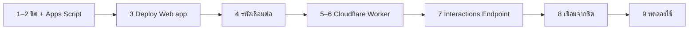

# 🛠️ ติดตั้งบอท Discord

ใช้เวลาประมาณ 15 นาที ทำครั้งเดียว ทุกส่วนใช้แพ็กเกจฟรี

**สิ่งที่ต้องมี:** บัญชี Google · เซิร์ฟเวอร์ Discord ที่คุณเป็นแอดมิน · บัญชี Cloudflare (สมัครฟรี)



---

## 0. เตรียมชีต

อัปโหลด [`sheets/income-expense-tracker.xlsx`](../sheets/income-expense-tracker.xlsx) ขึ้น Google Drive → เปิดด้วย Google Sheets → **ไฟล์ → บันทึกเป็น Google ชีต**
ข้อมูลตัวอย่างในหน้า Transaction ลบได้เลย (ลบเฉพาะคอลัมน์ B–F)

## 1. สร้างแอปและบอทใน Discord

1. ไปที่ <https://discord.com/developers/applications> → **New Application** → ตั้งชื่อ
2. หน้า **General Information** → คัดลอก **Public Key** เก็บไว้ (ใช้ในขั้นที่ 6)
3. หน้า **Bot** → **Reset Token** → คัดลอก Token เก็บไว้ (เหมือนรหัสผ่าน ห้ามแชร์)
4. หน้า **OAuth2 → URL Generator** → ติ๊ก `bot` และ `applications.commands` → เปิดลิงก์ที่ได้ → เลือกเซิร์ฟเวอร์ → **Authorize**

> ระบบนี้ใช้คำสั่งแบบ Slash Command จึง **ไม่ต้อง** เปิด Message Content Intent และไม่ต้องให้สิทธิ์อ่านช่องกับบอท

## 2. วางสคริปต์ในชีต

ในชีต: **ส่วนขยาย → Apps Script** → ลบโค้ดเดิม → วางโค้ดจาก [`apps-script/Code.gs`](../apps-script/Code.gs) → กดบันทึก 💾

## 3. Deploy เป็น Web app

หน้า Apps Script → **Deploy → New deployment** → ⚙️ **Select type: Web app**

| ช่อง | ค่า |
|---|---|
| Execute as | **Me** |
| Who has access | **Anyone** |

กด **Deploy** → อนุญาตสิทธิ์ → คัดลอก **Web app URL** (ลงท้ายด้วย `/exec`)

> ถ้า Google ขึ้นว่า *Google hasn't verified this app* ให้กด **Advanced → Go to … (unsafe) → Allow** ที่ขึ้นแบบนี้เพราะเป็นสคริปต์ของคุณเองที่ไม่ได้ส่งให้ Google ตรวจ

## 4. สร้างรหัสเชื่อมต่อ

กลับไปที่ชีต → รีเฟรช → เมนู **🤖 Discord → ① สร้างรหัสเชื่อมต่อ** → คัดลอกรหัสยาว 64 ตัว

## 5. สร้าง Cloudflare Worker

<https://dash.cloudflare.com> → **Workers & Pages → Create** → **Hello World** → ตั้งชื่อ (เช่น `money-bot`) → **Deploy** → **Edit code** → ลบโค้ดเดิม → วางโค้ดจาก [`worker/worker.js`](../worker/worker.js) → **Deploy**

จดลิงก์ Worker ไว้ เช่น `https://money-bot.<ชื่อคุณ>.workers.dev`

<details>
<summary>ใช้ Wrangler CLI แทนหน้าเว็บ</summary>

```bash
cd worker
npx wrangler deploy
npx wrangler secret put DISCORD_BOT_TOKEN
npx wrangler secret put SHARED_SECRET
# ใส่ DISCORD_PUBLIC_KEY และ APPS_SCRIPT_URL ใน [vars] ของ wrangler.toml แล้ว deploy อีกครั้ง
```
</details>

## 6. ใส่ตัวแปรใน Worker

Worker → **Settings → Variables and Secrets → Add** (ครบแล้วกด **Deploy**)

| ชื่อ | ประเภท | ค่า |
|---|---|---|
| `DISCORD_PUBLIC_KEY` | Text | Public Key จากขั้นตอนที่ 1 |
| `DISCORD_BOT_TOKEN` | **Secret** | Bot Token จากขั้นตอยที่ 1 |
| `APPS_SCRIPT_URL` | Text | Web app URL จากขั้นตอนที่ 3 |
| `SHARED_SECRET` | **Secret** | รหัสจากขั้นตอนที่ 4 |

## 7. ตั้ง Interactions Endpoint URL

Developer Portal → แอปของคุณ → **General Information** → **Interactions Endpoint URL** = ลิงก์ Worker → **Save Changes**

Discord จะส่งคำขอทดสอบไปที่ Worker ทันที ถ้าบันทึกไม่ผ่าน ให้ตรวจ `DISCORD_PUBLIC_KEY` และว่ากด Deploy หลังใส่ตัวแปรแล้ว

## 8. เชื่อม Worker จากชีต

เมนู **🤖 Discord → ② เชื่อม Worker + ลงทะเบียนคำสั่ง**

1. วางลิงก์ Worker
2. **(แนะนำ)** วางลิงก์ช่องที่ใช้จด: ใน Discord คลิกขวาที่ชื่อช่อง → **Copy Link**
   - คำสั่งจะขึ้นในเซิร์ฟเวอร์นั้นทันที (ถ้าไม่ใส่ และบอทอยู่หลายเซิร์ฟเวอร์ ระบบจะลงทะเบียนแบบทุกเซิร์ฟเวอร์ ซึ่งอาจใช้เวลาสักพักกว่าจะขึ้น)
   - ถ้าใช้คำสั่งนอกช่องนี้ ตัวเลขจะเห็นเฉพาะคนสั่ง

ระบบจะลงทะเบียนคำสั่ง `/จ่าย /รับ /ออม /จด /สรุป /ยกเลิก` แล้วแสดงรายงานตรวจทุกจุด ควรเป็น ✅ ทั้งหมด

## 9. ทดลองใช้

ในช่องที่ใช้จด พิมพ์ `/จ่าย` → จำนวน `120` → หมวด `ค่าอาหาร` → รายละเอียด `ข้าวมันไก่` → Enter

บอทจะขึ้นว่ากำลังคิดสักครู่ แล้วแสดงผลการบันทึกพร้อมยอดรวมของเดือน หน้า Transaction จะมีแถวใหม่เพิ่มขึ้น

---

## 🩺 แก้ปัญหา

เริ่มจากเมนู **🤖 Discord → 🩺 ตรวจสอบสถานะ** เสมอ ข้อที่ขึ้น ❌ จะบอกวิธีแก้ไว้ใต้ข้อนั้น

| อาการ | สาเหตุที่พบบ่อย | วิธีแก้ |
|---|---|---|
| บันทึก Interactions Endpoint URL ไม่ผ่าน | `DISCORD_PUBLIC_KEY` ผิด หรือยังไม่ได้กด Deploy | ตรวจค่าแล้วกด Deploy ใน Cloudflare |
| ไม่เห็นคำสั่งใน Discord | ยังไม่ได้ลงทะเบียน · ตอนเชิญบอทไม่ได้ติ๊ก `applications.commands` · บัญชีไม่ใช่แอดมิน | เมนู 🔄 อัปเดตหมวดใน Discord · เชิญบอทใหม่ · กด Ctrl+R ใน Discord |
| `รหัสเชื่อมต่อไม่ตรงกัน` | `SHARED_SECRET` ไม่ตรงกับเมนู ① | คัดลอกจากเมนู ① ใหม่ แล้วกด Deploy |
| `Apps Script ไม่ได้ตอบเป็นข้อมูล … Who has access: Anyone` | ตอน Deploy เลือกสิทธิ์ผิด | Deploy → Manage deployments → ✏️ → Who has access: **Anyone** |
| `The application did not respond` | Worker ยังไม่ Deploy หรือ endpoint ชี้ผิดที่ | ดู 🩺 และ Cloudflare → Worker → **Logs** |
| แก้ `Code.gs` แล้วไม่มีผล | Web app ยังใช้เวอร์ชันเก่า | Deploy → Manage deployments → ✏️ → Version: **New version** → Deploy (ลิงก์ `/exec` เดิม) |
| หมวดใหม่ไม่ขึ้นใน Drop-down | ยังไม่ได้อัปเดตคำสั่ง | เมนู 🔄 อัปเดตหมวดใน Discord |
