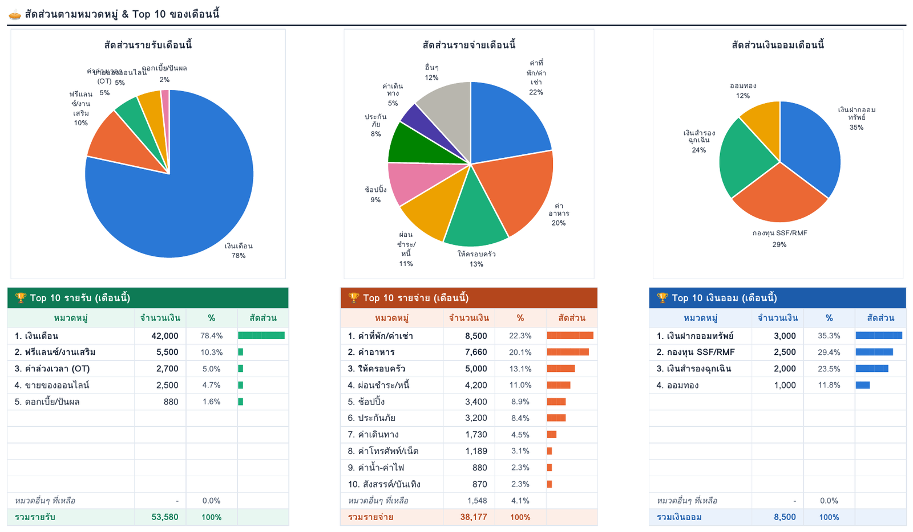
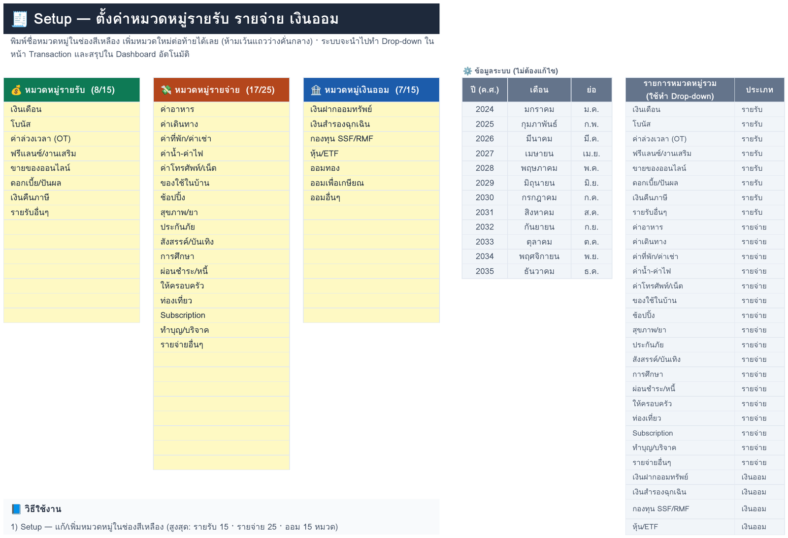

# 📒 วิธีใช้งาน

## คำสั่งใน Discord

| คำสั่ง | ช่องที่ต้องใส่ | ตัวอย่าง |
|---|---|---|
| `/จ่าย` | **จำนวน** · **หมวด** (เลือกจากรายการ) · รายละเอียด · วันที่ | `/จ่าย จำนวน:120 หมวด:ค่าอาหาร รายละเอียด:ข้าวมันไก่` |
| `/รับ` | เหมือน `/จ่าย` | `/รับ จำนวน:42000 หมวด:เงินเดือน` |
| `/ออม` | เหมือน `/จ่าย` | `/ออม จำนวน:3000 หมวด:หุ้น/ETF วันที่:เมื่อวาน` |
| `/จด` | **ข้อความ** | `/จด จ่าย 120 อาหาร ข้าวมันไก่` |
| `/สรุป` | เดือน · ปี (ไม่ใส่ = เดือนนี้) | `/สรุป เดือน:9 ปี:2569` |
| `/ยกเลิก` | – | ลบรายการล่าสุดที่จดผ่าน Discord (ย้อนได้สูงสุด 20 รายการ) |

ตัวหนา = ต้องใส่ · **วันที่** ใช้ได้ทั้ง `25/9`, `25/9/2026`, `25/9/69` (พ.ศ.), `เมื่อวาน`, `เมื่อวานซืน`
ถ้าใส่ `30/12` ตอนต้นปี ระบบจะนับเป็นปีก่อนให้เอง

### ผลลัพธ์

- บอทตอบกลับทันทีพร้อมหมวด วันที่ ยอดรวมของเดือนในประเภทนั้น และเลขแถวในชีต
- ถ้าใช้คำสั่งนอกช่องที่ตั้งไว้ ข้อความในช่องจะขึ้นแค่ว่า "🔒 บันทึกแล้ว" รายละเอียดเห็นเฉพาะคนสั่ง
- ค่าเริ่มต้นให้เฉพาะคนที่มีสิทธิ์ **Manage Server** ใช้คำสั่งได้ ปรับได้ที่ Server Settings → Integrations → แอปของคุณ

---

## `/จด` — พิมพ์รวดเดียว

รูปแบบ: `[วันที่] ประเภท จำนวน หมวด [รายละเอียด]` (วันที่จะอยู่ตรงไหนก็ได้)

```
จ่าย 120 อาหาร ข้าวมันไก่
รับ 42000 เงินเดือน
ออม 3000 หุ้น DCA
จ่าย 850 ไฟ 25/9
เมื่อวาน จ่าย 60 กาแฟ
-89 กาแฟ               ← "-" = รายจ่าย, "+" = รายรับ
รับ 1.5k ขายเสื้อมือสอง  ← 1.5k = 1,500
```

| ส่วน | รองรับ |
|---|---|
| ประเภท | `จ่าย` `รับ` `ออม` `รายจ่าย` `รายรับ` `เงินออม` `-` `+` |
| จำนวน | `120` `1,250.50` `1.5k` `5พัน` `฿45` `45 บาท` เลขไทย `๑๒๐` |
| หมวด | ระบบไล่หาตามลำดับนี้ ↓ |

**ลำดับการเลือกหมวด**
1. ขึ้นต้นด้วยชื่อหมวดเต็ม เช่น `ค่าอาหารเย็น` → ค่าอาหาร
2. เลขหมวด เช่น `จ่าย 120 1 ข้าว` → หมวดที่ 1 (ดูเลขด้วย `/จด หมวด`)
3. คำย่อ เช่น `ข้าว` `กาแฟ` → ค่าอาหาร · `bts` `grab` `น้ำมัน` → ค่าเดินทาง (ดูตารางด้านล่าง)
4. คำที่เป็นส่วนหนึ่งของชื่อหมวด เช่น `เช่า` → ค่าที่พัก/ค่าเช่า · `ssf` → กองทุน SSF/RMF
5. ถ้าไม่ตรงหมวดไหน จะลงหมวด "…อื่นๆ" และบอทจะบอกให้รู้ (พิมพ์ `/ยกเลิก` ได้ถ้าลงผิด)

ถ้าคำนั้นตรงกับหลายหมวด เช่น `ค่า` บอทจะถามกลับว่าหมายถึงหมวดไหน และยังไม่บันทึก

### คำสั่งย่อยใน `/จด`

| พิมพ์ | ผล |
|---|---|
| `วิธีใช้` | แสดงวิธีใช้ |
| `หมวด` | รายชื่อหมวดพร้อมเลข |
| `สรุป` / `สรุป 9` / `สรุป 9/2569` | สรุปยอดของเดือน |
| `ยกเลิก` | ลบรายการล่าสุด |

### คำย่อที่มีให้ (แก้/เพิ่มได้ที่ `ALIASES` ใน `Code.gs`)

| หมวด | คำย่อ |
|---|---|
| ค่าอาหาร | ข้าว กาแฟ ขนม ชานม น้ำดื่ม ก๋วยเตี๋ยว มื้อ กิน grabfood lineman foodpanda |
| ค่าเดินทาง | รถ แท็กซี่ grab bolt วิน bts mrt น้ำมัน ทางด่วน จอดรถ |
| ค่าที่พัก/ค่าเช่า | ค่าเช่า เช่า หอพัก คอนโด |
| ค่าน้ำ-ค่าไฟ | ไฟ ประปา ค่าน้ำ |
| ค่าโทรศัพท์/เน็ต | มือถือ โทรศัพท์ เน็ต wifi internet ais true dtac |
| ของใช้ในบ้าน | ทิชชู่ ผงซักฟอก สบู่ ยาสีฟัน ของใช้ |
| ช้อปปิ้ง | เสื้อ รองเท้า กางเกง shopee lazada |
| สุขภาพ/ยา | ร้านยา ค่ายา หาหมอ โรงพยาบาล คลินิก ทำฟัน ตรวจสุขภาพ |
| สังสรรค์/บันเทิง | หนัง เหล้า เบียร์ ปาร์ตี้ คอนเสิร์ต เกม |
| การศึกษา | หนังสือ คอร์ส เรียน |
| อื่น ๆ | ผ่อน บัตรเครดิต → ผ่อนชำระ/หนี้ · เที่ยว โรงแรม → ท่องเที่ยว · netflix spotify youtube → Subscription · บุญ วัด → ทำบุญ/บริจาค |
| รายรับ | โอที → ค่าล่วงเวลา · ค่าจ้าง งานนอก → ฟรีแลนซ์ · ขาย → ขายของออนไลน์ · ปันผล ดอกเบี้ย · ภาษี → เงินคืนภาษี |
| เงินออม | ฝาก · สำรอง · กองทุน · dca → หุ้น/ETF · ทอง → ออมทอง · เกษียณ |

---

## ใช้งานในชีต

| หน้า | วิธีใช้ |
|---|---|
| **Dashboard Overview** | เปลี่ยนปีที่ช่องสีเหลืองมุมขวาบน |
| **Monthly Overview** | เลือกปีและเดือนที่ช่องสีเหลือง |
| **Transaction** | จดเองได้ด้วย: วันที่ → ประเภท → หมวด → จำนวน → รายละเอียด · คอลัมน์ "ตรวจสอบ" จะขึ้น ⚠ ถ้ากรอกไม่ครบหรือหมวดไม่ตรงประเภท |
| **Setup** | แก้/เพิ่มหมวดในช่องสีเหลือง (ห้ามเว้นแถวว่างคั่น) **แล้วกดเมนู 🔄 อัปเดตหมวดใน Discord** |

- **แถวเกิน 5,000:** สูตรสรุปนับทุกแถวอยู่แล้ว ถ้าจดผ่านบอท ระบบจะเพิ่มแถวและคัดลอก Drop-down กับสูตรตรวจสอบให้เอง ถ้าจดในชีตเอง ให้คัดลอกแถวสุดท้าย (B–G) ลงไปในแถวใหม่
- **คงเหลือ (Cash Flow)** = รายรับ − รายจ่าย − เงินออม · **อัตราการออม** = เงินออม ÷ รายรับ

## เมนู 🤖 Discord ในชีต

| เมนู | ใช้เมื่อ |
|---|---|
| ① สร้างรหัสเชื่อมต่อ | ติดตั้งครั้งแรก (เปิดซ้ำจะเห็นรหัสเดิม) |
| ② เชื่อม Worker + ลงทะเบียนคำสั่ง | ติดตั้งครั้งแรก หรือเปลี่ยน Worker/ช่อง |
| 🔄 อัปเดตหมวดใน Discord | หลังแก้หมวดในหน้า Setup |
| 🩺 ตรวจสอบสถานะ | อะไรก็ตามที่ทำงานไม่ถูก |

## ภาพตัวอย่าง

| Monthly Overview — สัดส่วนและ Top 10 ของเดือน | Setup — หมวดหมู่ |
|---|---|
|  |  |
